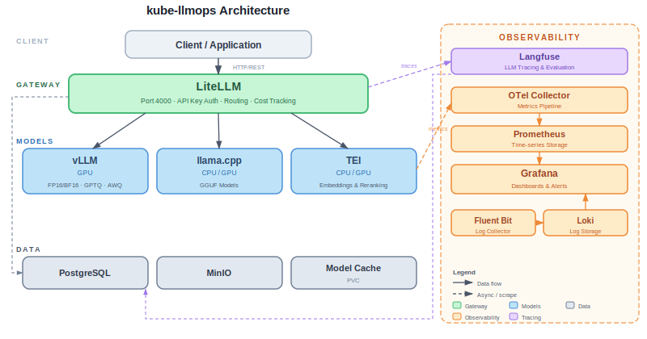

[English](README.md) | **中文**

# kube-llmops

**Kubernetes 原生 LLMOps 平台** -- 一条命令部署、管理、监控并优化你的整个 LLM 基础设施。

> [!NOTE]
> 本项目正在积极开发中。请点个 Star 并 Watch 以获取最新动态！

## 什么是 kube-llmops？

`kube-llmops` 是一个开箱即用的 Helm Chart（Helm 图表），可在 Kubernetes 上一键部署完整的 LLM 运维栈：

- **模型推理服务** -- vLLM、llama.cpp 或 TEI，根据模型格式自动选择推理引擎
- **AI 网关** -- LiteLLM 提供统一的 OpenAI 兼容 API、API Key 管理、成本追踪
- **可观测性** -- OpenTelemetry + Prometheus + Grafana 仪表盘 + Langfuse LLM 调用追踪
- **基础设施** -- GPU 调度、分布式模型缓存、自动扩缩容

```bash
helm install kube-llmops kube-llmops/kube-llmops-stack -f values-minimal.yaml
```

## 使用场景

- **"我想部署 Qwen3.5-122B 并让 5 个团队共享，同时设置 Token 预算限制"**
- **"我想查看本月哪个团队消耗了最多的 GPU 时长"**
- **"我想让一个 GGUF 模型跑在 llama.cpp 上，同时让一个全精度模型跑在 vLLM 上，并统一到同一个 API 后面"**
- **"我想对每一次 LLM 请求进行全链路追踪，记录完整的 Prompt（提示词）、Token 用量、费用和延迟"**

## 架构

<p align="center">
  
</p>

详细技术设计请参阅 [ARCHITECTURE.md](ARCHITECTURE.md)。

## 快速开始

### 前置条件

- Kubernetes 集群 (1.28+) 且包含 GPU 节点，或使用 `kind` 进行仅 CPU 的演示
- Helm 3.x
- kubectl

### 安装

```bash
# 添加 Helm 仓库（v0.1.0 正式发布后可用）
helm repo add kube-llmops https://GaeaRuiW.github.io/kube-llmops
helm repo update

# 使用最小配置安装（1 块 GPU、1 个模型、基础监控）
helm install kube-llmops kube-llmops/kube-llmops-stack -f values-minimal.yaml

# 或：仅 CPU 演示模式（无需 GPU）
helm install kube-llmops kube-llmops/kube-llmops-stack -f values-ci.yaml
```

### 与模型对话

```bash
kubectl port-forward svc/kube-llmops-litellm 4000:4000 &

curl http://localhost:4000/v1/chat/completions \
  -H "Authorization: Bearer sk-kube-llmops-dev" \
  -H "Content-Type: application/json" \
  -d '{"model":"qwen2-5-0-5b","messages":[{"role":"user","content":"Hello!"}]}'
```

### 访问管理界面

```bash
kubectl port-forward svc/kube-llmops-litellm 4000:4000 &    # AI Gateway
kubectl port-forward svc/kube-llmops-grafana 3000:3000 &     # Metrics
kubectl port-forward svc/kube-llmops-langfuse 3001:3000 &    # LLM Tracing
```

| 服务 | URL | 默认凭据 |
|---|---|---|
| **LiteLLM**（AI 网关 + 管理界面） | `http://localhost:4000/ui` | 任意用户名 / `sk-kube-llmops-dev` |
| **Grafana**（监控仪表盘） | `http://localhost:3000` | `admin` / `admin` |
| **Langfuse**（LLM 调用追踪） | `http://localhost:3001` | `admin@kube-llmops.local` / `admin123!` |

> [!WARNING]
> 以上为开发环境默认配置。生产环境请通过 `--set` 参数进行覆盖：
> ```bash
> helm install kube-llmops kube-llmops/kube-llmops-stack \
>   --set litellm.masterKey=sk-your-secret-key \
>   --set observability.grafana.adminPassword=your-grafana-pw \
>   --set langfuse.init.userPassword=your-langfuse-pw \
>   --set langfuse.externalUrl=https://langfuse.your-domain.com
> ```

## 功能对比

| 功能特性 | kube-llmops | 原生 vLLM | KAITO | KServe |
|---|---|---|---|---|
| 推理引擎自动选择（GPTQ→vLLM、GGUF→llama.cpp） | 支持 | 不适用 | 不支持 | 不支持 |
| AI 网关（Key 管理、成本追踪、速率限制） | 支持 | 不支持 | 不支持 | 不支持 |
| LLM 调用追踪（Prompt、Token、每次请求费用） | 支持 | 不支持 | 不支持 | 不支持 |
| 预置 Grafana 仪表盘（6 个） | 支持 | 不支持 | 不支持 | 不支持 |
| GPU 监控（DCGM） | 支持 | 需自行搭建 | 不支持 | 不支持 |
| 一键部署完整栈 | 支持 | 不适用 | 不支持 | 不支持 |
| 云平台无关 | 支持 | 支持 | 仅 Azure | 支持 |

## 部署配置

| 配置文件 | GPU | 模型数量 | 监控 | 追踪 | 适用场景 |
|---|---|---|---|---|---|
| `values-ci.yaml` | 无 | 微型（CPU） | 基础 | 关闭 | CI / 演示 |
| `values-minimal.yaml` | 1 块 | 1 个（小） | Prometheus + Grafana | 关闭 | 开发环境 |
| `values-standard.yaml` | 4-8 块 | 2-3 个 | 完整 OTel 栈 | Langfuse | 团队协作 |
| `values-production.yaml` | 16+ 块 | N 个 | 完整 + 高可用 | 全量 | 企业生产 |

## 文档

- [快速入门](docs/getting-started.zh-CN.md) -- 安装、配置与故障排除
- [架构设计](ARCHITECTURE.md) -- 完整的技术设计与技术选型
- [实施计划](PLAN.md) -- 里程碑、CI/CD 策略与待办事项
- [更新日志](CHANGELOG.zh-CN.md) -- 版本发布说明
- [贡献指南](CONTRIBUTING.zh-CN.md) -- 如何参与贡献

## 路线图

- [x] **v0.1.0（MVP）** -- 模型推理服务 + 网关 + 指标监控 + 调用追踪
- [ ] **v0.2.0** -- 日志 + 自动扩缩容 + 模型缓存 + 安全加固
- [ ] **v0.3.0** -- RAG + 向量数据库 + Inference Gateway（IGW，推理网关）
- [ ] **v0.4.0** -- 微调 + ML 平台
- [ ] **v0.5.0** -- 解耦式推理服务（llm-d）
- [ ] **v1.0.0** -- Operator + CLI + 可视化面板

## 许可证

[Apache License 2.0](LICENSE)

### 许可证说明

本项目采用 Apache 2.0 许可证。但部分可选依赖组件使用了不同的许可证：

| 组件 | 许可证 | 是否必需？ |
|---|---|---|
| Grafana | AGPL-3.0 | 可选（可替换为自有方案） |
| Loki | AGPL-3.0 | 可选（可使用 OpenSearch 替代） |
| 其他所有组件 | Apache 2.0 / MIT / BSD | 是 |

如果 AGPL 许可证对贵组织有合规方面的顾虑，可以禁用 Grafana 和 Loki，并替换为您自有的可视化和日志存储方案。

## 参与贡献

欢迎贡献代码！请参阅 [CONTRIBUTING.md](CONTRIBUTING.md) 了解贡献指南。

## Star 历史

如果您觉得本项目对您有帮助，请给我们一个 Star！
